# Diagrama Entidad-Relacion de la base de datos

Fuente: `docs/schema.sql`.

Este diagrama representa la base de datos PostgreSQL utilizada por el sistema
del mapa 3D del Instituto Tecnologico de Oaxaca. Incluye las 25 tablas
creadas por el esquema actual, sus llaves primarias, llaves foraneas y
relaciones.

```mermaid
erDiagram
  BUILDING_CATEGORIES ||--o{ BUILDINGS : categoriza
  BUILDINGS ||--o{ BUILDING_IMAGES : tiene
  BUILDINGS ||--o{ CLASSROOMS : contiene
  BUILDINGS ||--o{ BUILDING_PROCEDURES : relaciona
  PROCEDURES ||--o{ BUILDING_PROCEDURES : relaciona
  PROCEDURES ||--o{ PROCEDURE_REQUIREMENTS : requiere
  PROFESSORS ||--o{ SCHEDULES : imparte
  CLASSROOMS ||--o{ SCHEDULES : usa
  STUDENTS ||--o{ STUDENT_SCHEDULES : inscrito
  SCHEDULES ||--o{ STUDENT_SCHEDULES : asignado
  BUILDINGS ||--o{ BUILDING_SCHEDULES : abre
  BUILDINGS ||--o{ DEPARTMENTS : aloja
  DEPARTMENTS ||--o{ PROCEDURES : gestiona
  BUILDINGS ||--o{ TEACHER_CUBICLES : contiene
  PROFESSORS |o--o{ TEACHER_CUBICLES : ocupa
  DEPARTMENTS |o--o{ TEACHER_CUBICLES : asigna
  BUILDINGS ||--o{ HEADQUARTERS : aloja
  DEPARTMENTS |o--o{ HEADQUARTERS : vincula
  DEPARTMENTS |o--o{ INSTITUTIONAL_POSITIONS : publica
  BUILDINGS |o--o{ INSTITUTIONAL_POSITIONS : ubica
  BUILDINGS |o--o{ CAMPUS_CALIBRATION_POINTS : referencia
  BUILDINGS ||--o{ BUILDING_GEOFENCES : delimita

  ADMIN_USERS {
    VARCHAR id PK
    VARCHAR username UK
    VARCHAR full_name
    VARCHAR email UK
    VARCHAR password_hash
    VARCHAR role
    BOOLEAN is_active
    SMALLINT failed_login_attempts
    TIMESTAMP locked_until
    INTEGER token_version
    TIMESTAMP last_login_at
  }

  BUILDING_CATEGORIES {
    VARCHAR id PK
    VARCHAR code UK
    VARCHAR name UK
    TEXT description
    VARCHAR color_hex
    VARCHAR icon_name
    BOOLEAN is_active
  }

  BUILDINGS {
    VARCHAR id PK
    VARCHAR category_id FK
    VARCHAR code UK
    VARCHAR name
    VARCHAR slug UK
    TEXT description
    VARCHAR model_node_name
    DECIMAL x
    DECIMAL y
    DECIMAL z
    DECIMAL latitude
    DECIMAL longitude
    TEXT address_reference
    BOOLEAN is_active
    BOOLEAN is_priority
    TIMESTAMP deleted_at
  }

  BUILDING_IMAGES {
    VARCHAR id PK
    VARCHAR building_id FK
    TEXT image_url
    VARCHAR image_type
    VARCHAR title
    TEXT description
    BOOLEAN is_cover
    INTEGER sort_order
    BOOLEAN is_active
  }

  CLASSROOMS {
    VARCHAR id PK
    VARCHAR building_id FK
    VARCHAR code
    VARCHAR name
    TEXT description
    INTEGER floor
    INTEGER capacity
    VARCHAR type
    BOOLEAN is_active
    TIMESTAMP deleted_at
  }

  PROCEDURES {
    VARCHAR id PK
    VARCHAR name
    VARCHAR slug UK
    TEXT description
    VARCHAR resource_url
    VARCHAR kind
    VARCHAR department_id FK
    VARCHAR internal_location
    VARCHAR schedule_text
    VARCHAR validation_status
    BOOLEAN is_active
    TIMESTAMP deleted_at
  }

  PROCEDURE_REQUIREMENTS {
    VARCHAR id PK
    VARCHAR procedure_id FK
    TEXT description
    VARCHAR type
    BOOLEAN is_mandatory
    INTEGER display_order
  }

  BUILDING_PROCEDURES {
    VARCHAR building_id PK,FK
    VARCHAR procedure_id PK,FK
    VARCHAR notes
    TIMESTAMP created_at
  }

  AUDIT_LOGS {
    INTEGER id PK
    VARCHAR admin_user_id
    VARCHAR action
    VARCHAR resource_type
    VARCHAR resource_id
    JSONB details
    VARCHAR ip_address
    TIMESTAMP created_at
  }

  STUDENTS {
    VARCHAR id PK
    VARCHAR control_number UK
    VARCHAR full_name
    VARCHAR email
    VARCHAR program
    SMALLINT semester
    BOOLEAN is_active
    TIMESTAMP deleted_at
  }

  PROFESSORS {
    VARCHAR id PK
    VARCHAR employee_number UK
    VARCHAR rfc
    VARCHAR full_name
    VARCHAR email
    VARCHAR department
    BOOLEAN is_active
    TIMESTAMP deleted_at
  }

  SCHEDULES {
    VARCHAR id PK
    VARCHAR subject
    VARCHAR subject_code
    VARCHAR subject_name
    VARCHAR professor_id FK
    VARCHAR classroom_id FK
    SMALLINT day_of_week
    TIME start_time
    TIME end_time
    VARCHAR period
    VARCHAR group_code
    VARCHAR career_code
    VARCHAR career_name
  }

  STUDENT_SCHEDULES {
    VARCHAR student_id PK,FK
    VARCHAR schedule_id PK,FK
  }

  BUILDING_SCHEDULES {
    VARCHAR id PK
    VARCHAR building_id FK
    SMALLINT day_of_week
    TIME open_time
    TIME close_time
    BOOLEAN is_active
    TIMESTAMP deleted_at
  }

  DEPARTMENTS {
    VARCHAR id PK
    VARCHAR building_id FK
    VARCHAR name
    TEXT description
    VARCHAR schedule_text
    VARCHAR head_name
    VARCHAR contact
    BOOLEAN is_active
    TIMESTAMP deleted_at
  }

  TEACHER_CUBICLES {
    VARCHAR id PK
    VARCHAR building_id FK
    VARCHAR code
    VARCHAR professor_id FK
    VARCHAR department_id FK
    VARCHAR schedule_text
    TEXT notes
    BOOLEAN is_active
    TIMESTAMP deleted_at
  }

  HEADQUARTERS {
    VARCHAR id PK
    VARCHAR building_id FK
    VARCHAR name
    VARCHAR head_name
    VARCHAR department_id FK
    VARCHAR schedule_text
    VARCHAR contact
    BOOLEAN is_active
    TIMESTAMP deleted_at
  }

  GATES {
    VARCHAR id PK
    VARCHAR name
    TEXT description
    VARCHAR access_type
    VARCHAR status
    DOUBLE_PRECISION x
    DOUBLE_PRECISION y
    DOUBLE_PRECISION z
    BOOLEAN is_active
    TIMESTAMP deleted_at
  }

  INSTITUTIONAL_POSITIONS {
    VARCHAR id PK
    VARCHAR title
    VARCHAR person_name
    VARCHAR department_id FK
    VARCHAR building_id FK
    VARCHAR office_name
    TEXT_ARRAY search_keywords
    BOOLEAN is_public
    BOOLEAN is_active
    TIMESTAMP deleted_at
  }

  CAMPUS_STREETS {
    VARCHAR id PK
    VARCHAR name UK
    TEXT description
    DOUBLE_PRECISION x
    DOUBLE_PRECISION y
    DOUBLE_PRECISION z
    DOUBLE_PRECISION rotation
    INTEGER display_order
    BOOLEAN is_visible
    BOOLEAN is_active
  }

  QUICK_QUERIES {
    VARCHAR id PK
    VARCHAR label
    VARCHAR query
    VARCHAR category
    VARCHAR icon
    INTEGER priority
    BOOLEAN is_active
  }

  SEARCH_ALIASES {
    VARCHAR id PK
    VARCHAR entity_type
    VARCHAR entity_id
    VARCHAR alias
    BOOLEAN is_active
  }

  CAMPUS_CALIBRATION_POINTS {
    VARCHAR id PK
    VARCHAR building_id FK
    VARCHAR label
    DECIMAL latitude
    DECIMAL longitude
    DOUBLE_PRECISION accuracy_meters
    DOUBLE_PRECISION model_x
    DOUBLE_PRECISION model_z
    BOOLEAN is_active
  }

  CAMPUS_CALIBRATION_PROFILES {
    VARCHAR id PK
    VARCHAR name
    DECIMAL ref_lat
    DECIMAL ref_lng
    DOUBLE_PRECISION meters_lat
    DOUBLE_PRECISION meters_lng
    DOUBLE_PRECISION a_x
    DOUBLE_PRECISION b_x
    DOUBLE_PRECISION c_x
    DOUBLE_PRECISION a_z
    DOUBLE_PRECISION b_z
    DOUBLE_PRECISION c_z
    DOUBLE_PRECISION max_residual_meters
    DOUBLE_PRECISION avg_residual_meters
    BOOLEAN is_active
  }

  BUILDING_GEOFENCES {
    VARCHAR id PK
    VARCHAR building_id FK
    VARCHAR name
    JSONB polygon
    INTEGER priority
    BOOLEAN is_active
  }
```

## Lectura del modelo

- `building_categories` clasifica a `buildings`; cada edificio pertenece a una categoria.
- `buildings` es una entidad central: se relaciona con imagenes, aulas, horarios, departamentos, jefaturas, cubiculos, tramites, puntos de calibracion y geocercas.
- `building_procedures` resuelve una relacion muchos a muchos entre edificios y tramites/servicios.
- `procedure_requirements` guarda los requisitos de cada tramite.
- `schedules` relaciona profesores con aulas; `student_schedules` relaciona alumnos con horarios.
- `departments` depende de edificios y puede vincular tramites, cubiculos, jefaturas y cargos institucionales.
- `campus_calibration_points`, `campus_calibration_profiles` y `building_geofences` soportan la geolocalizacion y la calibracion GPS/modelo 3D.
- `search_aliases` es polimorfica: guarda `entity_type` y `entity_id`, por eso no tiene llave foranea directa hacia una sola tabla.
- `audit_logs` registra acciones administrativas, pero en el esquema actual `admin_user_id` se maneja como campo indexado sin llave foranea declarada.
